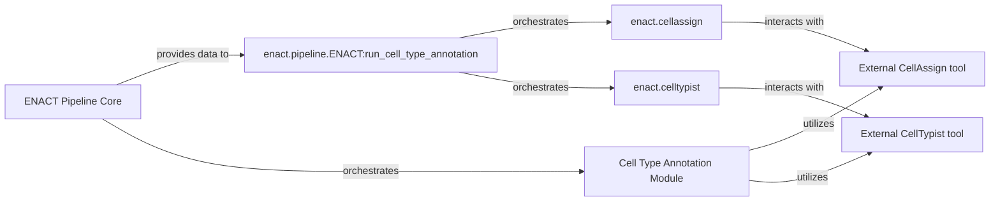

## Component Details

The Cell Type Annotation Module is fundamental because it directly addresses a core biological question in spatial transcriptomics: identifying the types of cells present in a sample. By integrating external, specialized tools like CellAssign and CellTypist, it leverages established methods for accurate cell type identification, which is crucial for downstream biological interpretation. The module acts as the bridge between the ENACT pipeline's processed gene expression data and these external annotation tools, ensuring data compatibility and efficient workflow. This structure allows the ENACT pipeline to remain flexible, supporting different cell type annotation methodologies without tightly coupling the core pipeline logic to the specifics of each external tool. The Cell Type Annotation Module encapsulates this complexity, providing a clean interface for the main pipeline.

### Cell Type Annotation Module

This module is responsible for assigning biological cell type labels to the aggregated cell-by-gene expression data. It acts as an interface and dispatcher to external, specialized cell type annotation pipelines, specifically supporting CellAssign and CellTypist. This module prepares the input data in the format required by these external tools and processes their outputs to enrich the cell data with crucial biological annotations.

**Related Classes/Methods**:

- <a href="https://github.com/Sanofi-Public/enact-pipeline/blob/master/src/enact/cellassign.py#L0-L0" target="_blank" rel="noopener noreferrer">`enact.cellassign` (0:0)</a>

- <a href="https://github.com/Sanofi-Public/enact-pipeline/blob/master/src/enact/celltypist.py#L0-L0" target="_blank" rel="noopener noreferrer">`enact.celltypist` (0:0)</a>

- <a href="https://github.com/Sanofi-Public/enact-pipeline/blob/master/src/enact/pipeline.py#L0-L0" target="_blank" rel="noopener noreferrer">`enact.pipeline.ENACT:run_cell_type_annotation` (0:0)</a>

### enact.pipeline.ENACT:run_cell_type_annotation

This method within the `ENACT` pipeline class orchestrates the cell type annotation process. It acts as the entry point for initiating cell type annotation, determining which external tool (CellAssign or CellTypist) to use based on configuration, and managing the overall flow.

**Related Classes/Methods**:

- <a href="https://github.com/Sanofi-Public/enact-pipeline/blob/master/src/enact/pipeline.py#L0-L0" target="_blank" rel="noopener noreferrer">`enact.pipeline.ENACT:run_cell_type_annotation` (0:0)</a>

### enact.cellassign

This module specifically handles the integration with the CellAssign tool. Its responsibilities include preparing the input data in the format required by CellAssign, executing the CellAssign pipeline, and processing its output to extract cell type annotations.

**Related Classes/Methods**:

- <a href="https://github.com/Sanofi-Public/enact-pipeline/blob/master/src/enact/cellassign.py#L0-L0" target="_blank" rel="noopener noreferrer">`enact.cellassign` (0:0)</a>

### enact.celltypist

Similar to `enact.cellassign`, this module manages the integration with the CellTypist tool. It prepares input data for CellTypist, executes the CellTypist annotation process, and parses its output to obtain cell type labels.

**Related Classes/Methods**:

- <a href="https://github.com/Sanofi-Public/enact-pipeline/blob/master/src/enact/celltypist.py#L0-L0" target="_blank" rel="noopener noreferrer">`enact.celltypist` (0:0)</a>

### ENACT Pipeline Core

The core component of the ENACT pipeline that provides aggregated cell-by-gene expression data.

**Related Classes/Methods**: _None_

### External CellAssign tool

An external tool used for cell type annotation via CellAssign.

**Related Classes/Methods**: _None_

### External CellTypist tool

An external tool used for cell type annotation via CellTypist.

**Related Classes/Methods**: _None_

### [FAQ](https://github.com/CodeBoarding/GeneratedOnBoardings/tree/main?tab=readme-ov-file#faq)