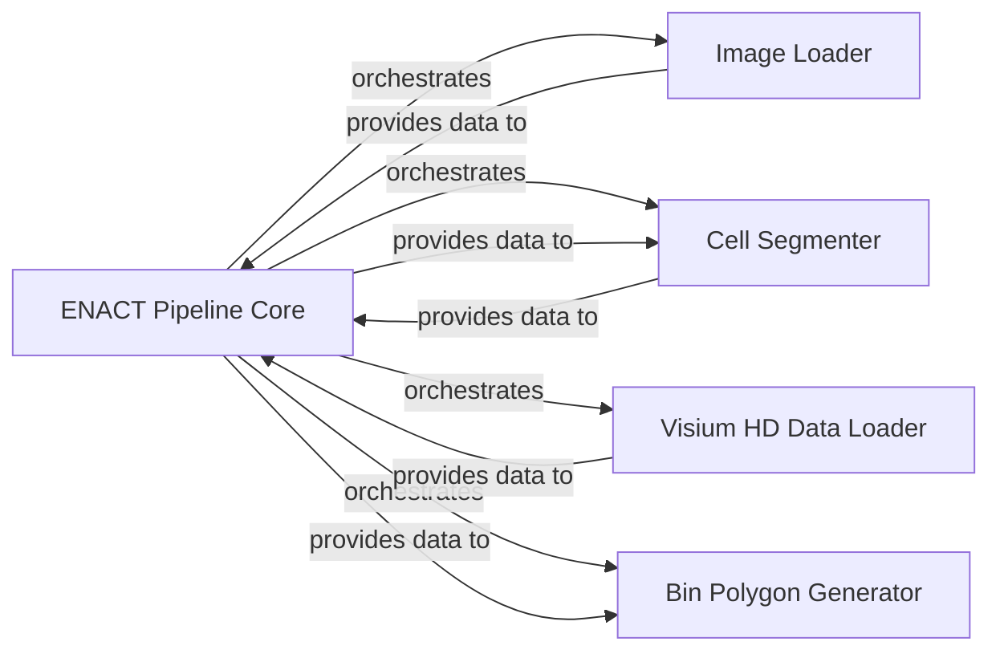

## Component Details

The ENACT Pipeline Core acts as the central orchestrator and data mediator, performing intermediate processing steps between the main functional components.

### ENACT Pipeline Core

The central orchestrator of the ENACT pipeline, responsible for coordinating the execution of all major processing steps. It manages data flow between components, performs crucial intermediate data transformations (e.g., image normalization, data structuring, chunking), and ensures that outputs from one stage are correctly prepared as inputs for the next. This component embodies the core logic and control flow of the entire analysis.

**Related Classes/Methods**:

- <a href="https://github.com/Sanofi-Public/enact-pipeline/blob/master/src/enact/pipeline.py#L0-L0" target="_blank" rel="noopener noreferrer">`enact.pipeline.ENACT` (0:0)</a>

- <a href="https://github.com/Sanofi-Public/enact-pipeline/blob/master/src/enact/pipeline.py#L0-L0" target="_blank" rel="noopener noreferrer">`enact.pipeline.ENACT:run_enact` (0:0)</a>

- <a href="https://github.com/Sanofi-Public/enact-pipeline/blob/master/src/enact/pipeline.py#L0-L0" target="_blank" rel="noopener noreferrer">`enact.pipeline.ENACT:normalize_image` (0:0)</a>

- <a href="https://github.com/Sanofi-Public/enact-pipeline/blob/master/src/enact/pipeline.py#L0-L0" target="_blank" rel="noopener noreferrer">`enact.pipeline.ENACT:convert_stardist_output_to_gdf` (0:0)</a>

- <a href="https://github.com/Sanofi-Public/enact-pipeline/blob/master/src/enact/pipeline.py#L0-L0" target="_blank" rel="noopener noreferrer">`enact.pipeline.ENACT:expand_nuclei_with_voronoi` (0:0)</a>

- <a href="https://github.com/Sanofi-Public/enact-pipeline/blob/master/src/enact/pipeline.py#L0-L0" target="_blank" rel="noopener noreferrer">`enact.pipeline.ENACT:split_df_to_chunks` (0:0)</a>

- <a href="https://github.com/Sanofi-Public/enact-pipeline/blob/master/src/enact/pipeline.py#L0-L0" target="_blank" rel="noopener noreferrer">`enact.pipeline.ENACT:generate_bins_gdf` (0:0)</a>

- <a href="https://github.com/Sanofi-Public/enact-pipeline/blob/master/src/enact/pipeline.py#L0-L0" target="_blank" rel="noopener noreferrer">`enact.pipeline.ENACT:assign_bins_to_cells` (0:0)</a>

### Image Loader

Manages the loading of Whole Slide Images (WSI) and initial cropping based on tissue position data, adapting to different image types (H&E, IF). It provides the raw, cropped image and the determined crop boundaries to the ENACT Pipeline Core for further processing.

**Related Classes/Methods**:

- <a href="https://github.com/Sanofi-Public/enact-pipeline/blob/master/src/enact/pipeline.py#L0-L0" target="_blank" rel="noopener noreferrer">`enact.pipeline.ENACT:load_image` (0:0)</a>

- <a href="https://github.com/Sanofi-Public/enact-pipeline/blob/master/src/enact/pipeline.py#L0-L0" target="_blank" rel="noopener noreferrer">`enact.pipeline.ENACT:get_image_crop_bounds` (0:0)</a>

### Cell Segmenter

Executes cell nucleus segmentation using the configured StarDist model, generating precise labels and polygons for individual cells from a pre-processed (normalized) image. It provides these raw segmentation results (labels and polygons) to the ENACT Pipeline Core for conversion and spatial analysis.

**Related Classes/Methods**:

- <a href="https://github.com/Sanofi-Public/enact-pipeline/blob/master/src/enact/pipeline.py#L0-L0" target="_blank" rel="noopener noreferrer">`enact.pipeline.ENACT:segment_cells` (0:0)</a>

### Visium HD Data Loader

Responsible for ingesting raw Visium HD spatial transcriptomics data (H5 gene expression and tissue position files). It aligns spatial coordinates with the cropped image frame, performs optional destriping, and selects highly variable genes, preparing the data as an AnnData object and providing it, along with the calculated bin size, to the ENACT Pipeline Core.

**Related Classes/Methods**:

- <a href="https://github.com/Sanofi-Public/enact-pipeline/blob/master/src/enact/pipeline.py#L0-L0" target="_blank" rel="noopener noreferrer">`enact.pipeline.ENACT:load_visiumhd_dataset` (0:0)</a>

- <a href="https://github.com/Sanofi-Public/enact-pipeline/blob/master/src/enact/pipeline.py#L0-L0" target="_blank" rel="noopener noreferrer">`enact.pipeline.ENACT:destripe` (0:0)</a>

### Bin Polygon Generator

Transforms spatial bin coordinates and bin size into geometric representations (Shapely polygons or points) based on the configured representation type. This component is utilized by the ENACT Pipeline Core (specifically by the generate_bins_gdf method) to create the spatial context for the transcriptomic data, enabling accurate mapping and analysis of gene expression patterns.

**Related Classes/Methods**:

- <a href="https://github.com/Sanofi-Public/enact-pipeline/blob/master/src/enact/pipeline.py#L0-L0" target="_blank" rel="noopener noreferrer">`enact.pipeline.ENACT:generate_bin_polys` (0:0)</a>

### [FAQ](https://github.com/CodeBoarding/GeneratedOnBoardings/tree/main?tab=readme-ov-file#faq)