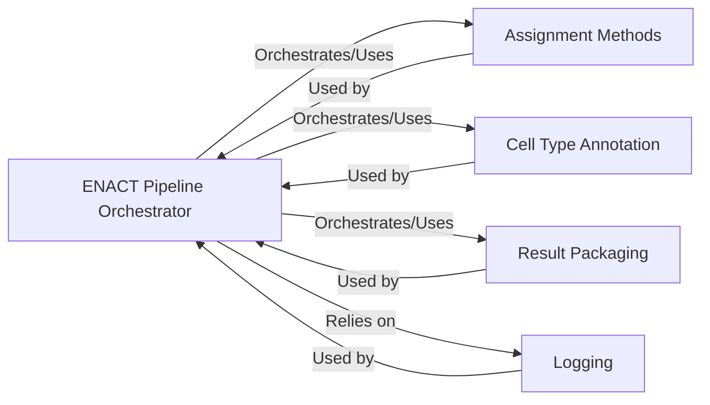

## Component Details

One paragraph explaining the functionality which is represented by this graph. What the main flow is and what is its purpose.

### ENACT Pipeline Orchestrator

This is the central control unit (`enact.pipeline.ENACT`) that initializes the pipeline with user configurations, manages the overall execution flow, sets up logging, and coordinates calls to all specialized processing modules. It acts as the main dispatcher, ensuring data flows correctly through different stages (e.g., image loading, cell segmentation, bin generation, bin-to-cell assignment, cell type annotation, and result packaging) and managing the lifecycle of the entire analysis. It also encapsulates internal functionalities such as image processing and segmentation, Visium HD data handling, and data chunking and merging.

**Related Classes/Methods**:

- <a href="https://github.com/Sanofi-Public/enact-pipeline/blob/master/src/enact/pipeline.py#L1-L1" target="_blank" rel="noopener noreferrer">`enact.pipeline.ENACT` (1:1)</a>

- <a href="https://github.com/Sanofi-Public/enact-pipeline/blob/master/src/enact/pipeline.py#L1-L1" target="_blank" rel="noopener noreferrer">`enact.pipeline.ENACT.__init__` (1:1)</a>

- <a href="https://github.com/Sanofi-Public/enact-pipeline/blob/master/src/enact/pipeline.py#L1-L1" target="_blank" rel="noopener noreferrer">`enact.pipeline.ENACT.run_enact` (1:1)</a>

- <a href="https://github.com/Sanofi-Public/enact-pipeline/blob/master/src/enact/pipeline.py#L1-L1" target="_blank" rel="noopener noreferrer">`enact.pipeline.ENACT.load_image` (1:1)</a>

- <a href="https://github.com/Sanofi-Public/enact-pipeline/blob/master/src/enact/pipeline.py#L1-L1" target="_blank" rel="noopener noreferrer">`enact.pipeline.ENACT.get_image_crop_bounds` (1:1)</a>

- <a href="https://github.com/Sanofi-Public/enact-pipeline/blob/master/src/enact/pipeline.py#L1-L1" target="_blank" rel="noopener noreferrer">`enact.pipeline.ENACT.normalize_image` (1:1)</a>

- <a href="https://github.com/Sanofi-Public/enact-pipeline/blob/master/src/enact/pipeline.py#L1-L1" target="_blank" rel="noopener noreferrer">`enact.pipeline.ENACT.segment_cells` (1:1)</a>

- <a href="https://github.com/Sanofi-Public/enact-pipeline/blob/master/src/enact/pipeline.py#L1-L1" target="_blank" rel="noopener noreferrer">`enact.pipeline.ENACT.expand_nuclei_with_voronoi` (1:1)</a>

- <a href="https://github.com/Sanofi-Public/enact-pipeline/blob/master/src/enact/pipeline.py#L1-L1" target="_blank" rel="noopener noreferrer">`enact.pipeline.ENACT.convert_stardist_output_to_gdf` (1:1)</a>

- <a href="https://github.com/Sanofi-Public/enact-pipeline/blob/master/src/enact/pipeline.py#L1-L1" target="_blank" rel="noopener noreferrer">`enact.pipeline.ENACT.convert_stardist_output_to_image` (1:1)</a>

- <a href="https://github.com/Sanofi-Public/enact-pipeline/blob/master/src/enact/pipeline.py#L1-L1" target="_blank" rel="noopener noreferrer">`enact.pipeline.ENACT.load_visiumhd_dataset` (1:1)</a>

- <a href="https://github.com/Sanofi-Public/enact-pipeline/blob/master/src/enact/pipeline.py#L1-L1" target="_blank" rel="noopener noreferrer">`enact.pipeline.ENACT.get_bin_size` (1:1)</a>

- <a href="https://github.com/Sanofi-Public/enact-pipeline/blob/master/src/enact/pipeline.py#L1-L1" target="_blank" rel="noopener noreferrer">`enact.pipeline.ENACT.destripe` (1:1)</a>

- <a href="https://github.com/Sanofi-Public/enact-pipeline/blob/master/src/enact/pipeline.py#L1-L1" target="_blank" rel="noopener noreferrer">`enact.pipeline.ENACT.generate_bin_polys` (1:1)</a>

- <a href="https://github.com/Sanofi-Public/enact-pipeline/blob/master/src/enact/pipeline.py#L1-L1" target="_blank" rel="noopener noreferrer">`enact.pipeline.ENACT.generate_bins_gdf` (1:1)</a>

- <a href="https://github.com/Sanofi-Public/enact-pipeline/blob/master/src/enact/pipeline.py#L1-L1" target="_blank" rel="noopener noreferrer">`enact.pipeline.ENACT.split_df_to_chunks` (1:1)</a>

- <a href="https://github.com/Sanofi-Public/enact-pipeline/blob/master/src/enact/pipeline.py#L1-L1" target="_blank" rel="noopener noreferrer">`enact.pipeline.ENACT.merge_files_sparse` (1:1)</a>

- <a href="https://github.com/Sanofi-Public/enact-pipeline/blob/master/src/enact/pipeline.py#L1-L1" target="_blank" rel="noopener noreferrer">`enact.pipeline.ENACT.merge_files` (1:1)</a>

### Assignment Methods

A collection of modules that provide different algorithms for assigning spatial bins (e.g., gene expression data) to segmented cells. These methods are invoked by the ENACT Pipeline Orchestrator based on the configured assignment strategy.

**Related Classes/Methods**:

- <a href="https://github.com/Sanofi-Public/enact-pipeline/blob/master/src/enact/assignment_methods/naive.py#L1-L1" target="_blank" rel="noopener noreferrer">`enact.assignment_methods.naive` (1:1)</a>

- <a href="https://github.com/Sanofi-Public/enact-pipeline/blob/master/src/enact/assignment_methods/weight_by_area.py#L1-L1" target="_blank" rel="noopener noreferrer">`enact.assignment_methods.weight_by_area` (1:1)</a>

- <a href="https://github.com/Sanofi-Public/enact-pipeline/blob/master/src/enact/assignment_methods/weight_by_gene.py#L1-L1" target="_blank" rel="noopener noreferrer">`enact.assignment_methods.weight_by_gene` (1:1)</a>

### Cell Type Annotation

Encapsulates the logic for performing cell type annotation using external tools like CellAssign or CellTypist. This component is a specialized processing unit invoked by the ENACT Pipeline Orchestrator to assign biological cell types to the processed cellular data.

**Related Classes/Methods**:

- <a href="https://github.com/Sanofi-Public/enact-pipeline/blob/master/src/enact/cellassign.py#L1-L1" target="_blank" rel="noopener noreferrer">`enact.cellassign.CellAssignPipeline` (1:1)</a>

- <a href="https://github.com/Sanofi-Public/enact-pipeline/blob/master/src/enact/celltypist.py#L1-L1" target="_blank" rel="noopener noreferrer">`enact.celltypist.CellTypistPipeline` (1:1)</a>

### Result Packaging

Handles the final steps of the pipeline, including merging output files, converting data formats (e.g., DataFrame to AnnData), and saving the processed results. It receives the final processed data from the ENACT Pipeline Orchestrator for output generation and persistence.

**Related Classes/Methods**:

- <a href="https://github.com/Sanofi-Public/enact-pipeline/blob/master/src/enact/package_results.py#L1-L1" target="_blank" rel="noopener noreferrer">`enact.package_results.PackageResults` (1:1)</a>

### Logging

Provides utility functions for logging messages throughout the pipeline's execution. This component is crucial for monitoring progress, debugging issues, and providing operational feedback.

**Related Classes/Methods**:

- <a href="https://github.com/Sanofi-Public/enact-pipeline/blob/master/src/enact/utils/logging.py#L1-L1" target="_blank" rel="noopener noreferrer">`enact.utils.logging.get_logger` (1:1)</a>

### [FAQ](https://github.com/CodeBoarding/GeneratedOnBoardings/tree/main?tab=readme-ov-file#faq)