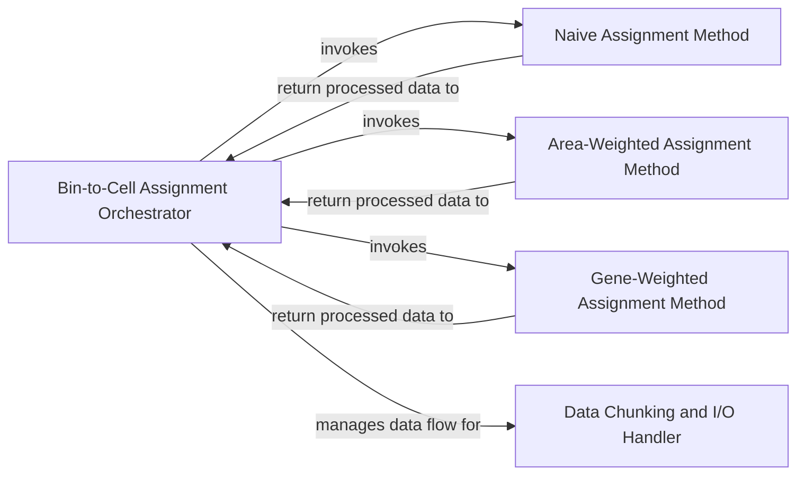

## Component Details

This core component integrates spatial transcriptomics bins with segmented cell boundaries. It assigns gene expression from spatial bins to individual cells based on various configurable methods (e.g., "naive," "weighted by area," "weighted by gene," or "weighted by cluster"). It processes data in chunks to manage memory efficiently and aggregates gene expression counts from multiple bins to generate comprehensive cell-by-gene expression profiles.

### Bin-to-Cell Assignment Orchestrator

This component, embodied by the `assign_bins_to_cells` method within the `ENACT` pipeline, acts as the central control unit for the entire spatial assignment process. It manages the loading of chunked spatial bin and cell boundary data, performs initial spatial joins to identify overlaps, and dynamically dispatches the assignment task to specific weighting methods based on user configuration. It also handles the final aggregation and saving of cell-by-gene expression profiles.

**Related Classes/Methods**:

- <a href="https://github.com/Sanofi-Public/enact-pipeline/blob/master/src/enact/pipeline.py#L1-L1" target="_blank" rel="noopener noreferrer">`enact.pipeline.ENACT:assign_bins_to_cells` (1:1)</a>

### Naive Assignment Method

Implemented by the `naive_assignment` function, this component provides the simplest approach to bin-to-cell assignment. It assigns gene expression only from bins that uniquely overlap with a single cell, effectively discarding gene expression from bins that overlap with multiple cells. Each unique bin is given a weight of 1.

**Related Classes/Methods**:

- <a href="https://github.com/Sanofi-Public/enact-pipeline/blob/master/src/enact/assignment_methods/naive.py#L3-L7" target="_blank" rel="noopener noreferrer">`enact.assignment_methods.naive.naive_assignment` (3:7)</a>

### Area-Weighted Assignment Method

This component, represented by the `weight_by_area_assignment` function, refines the bin-to-cell assignment by considering the spatial overlap area. For bins that intersect with multiple cells, it calculates a weight for each cell based on the proportion of the bin's area that overlaps with that specific cell. This allows for a more nuanced distribution of gene expression.

**Related Classes/Methods**:

- <a href="https://github.com/Sanofi-Public/enact-pipeline/blob/master/src/enact/assignment_methods/weight_by_area.py#L29-L45" target="_blank" rel="noopener noreferrer">`enact.assignment_methods.weight_by_area.weight_by_area_assignment` (29:45)</a>

### Gene-Weighted Assignment Method

The `weight_by_gene_assignment` function implements a sophisticated assignment strategy that leverages the gene expression profiles of cells. For bins that overlap with multiple cells, it determines the contribution of each cell to the bin's gene expression based on the unique gene signature of the parent cells. This method aims to assign gene counts more accurately by considering the biological context of gene expression.

**Related Classes/Methods**:

- <a href="https://github.com/Sanofi-Public/enact-pipeline/blob/master/src/enact/assignment_methods/weight_by_gene.py#L42-L88" target="_blank" rel="noopener noreferrer">`enact.assignment_methods.weight_by_gene.weight_by_gene_assignment` (42:88)</a>

### Data Chunking and I/O Handler

While not a distinct class, the `assign_bins_to_cells` method extensively incorporates logic for handling data in chunks. This involves loading spatial data (bins and cells) from chunked files, processing each chunk independently, and saving the intermediate and final results (cell-by-gene assignments, cell index lookups) back into chunked files. This approach is critical for managing memory efficiently when dealing with large datasets.

**Related Classes/Methods**:

- <a href="https://github.com/Sanofi-Public/enact-pipeline/blob/master/src/enact/pipeline.py#L1-L1" target="_blank" rel="noopener noreferrer">`enact.pipeline.ENACT:assign_bins_to_cells` (1:1)</a>

### [FAQ](https://github.com/CodeBoarding/GeneratedOnBoardings/tree/main?tab=readme-ov-file#faq)