```mermaid

graph LR

    ENACT_Pipeline_Orchestrator["ENACT Pipeline Orchestrator"]

    Data_Ingestion_Preprocessing["Data Ingestion & Preprocessing"]

    Spatial_Assignment_Engine["Spatial Assignment Engine"]

    Cell_Type_Annotation_Module["Cell Type Annotation Module"]

    Results_Management_Output["Results Management & Output"]

    Utility_Support_Services["Utility & Support Services"]

    ENACT_Pipeline_Orchestrator -- "Calls" --> Data_Ingestion_Preprocessing

    ENACT_Pipeline_Orchestrator -- "Calls" --> Spatial_Assignment_Engine

    ENACT_Pipeline_Orchestrator -- "Calls" --> Cell_Type_Annotation_Module

    ENACT_Pipeline_Orchestrator -- "Calls" --> Results_Management_Output

    ENACT_Pipeline_Orchestrator -- "Utilizes" --> Utility_Support_Services

    Data_Ingestion_Preprocessing -- "Provides Data To" --> Spatial_Assignment_Engine

    Data_Ingestion_Preprocessing -- "Utilizes" --> Utility_Support_Services

    Spatial_Assignment_Engine -- "Receives Data From" --> Data_Ingestion_Preprocessing

    Spatial_Assignment_Engine -- "Provides Data To" --> Cell_Type_Annotation_Module

    Spatial_Assignment_Engine -- "Provides Data To" --> Results_Management_Output

    Spatial_Assignment_Engine -- "Utilizes" --> Utility_Support_Services

    Cell_Type_Annotation_Module -- "Receives Data From" --> Spatial_Assignment_Engine

    Cell_Type_Annotation_Module -- "Provides Data To" --> Results_Management_Output

    Cell_Type_Annotation_Module -- "Utilizes" --> Utility_Support_Services

    Results_Management_Output -- "Receives Data From" --> Spatial_Assignment_Engine

    Results_Management_Output -- "Receives Data From" --> Cell_Type_Annotation_Module

    Results_Management_Output -- "Utilizes" --> Utility_Support_Services

    Utility_Support_Services -- "Used By" --> ENACT_Pipeline_Orchestrator

    Utility_Support_Services -- "Used By" --> Data_Ingestion_Preprocessing

    Utility_Support_Services -- "Used By" --> Spatial_Assignment_Engine

    Utility_Support_Services -- "Used By" --> Cell_Type_Annotation_Module

    Utility_Support_Services -- "Used By" --> Results_Management_Output

    click ENACT_Pipeline_Orchestrator href "https://github.com/Sanofi-Public/enact-pipeline/blob/main/.codeboarding//ENACT_Pipeline_Orchestrator.md" "Details"

    click Data_Ingestion_Preprocessing href "https://github.com/Sanofi-Public/enact-pipeline/blob/main/.codeboarding//Data_Ingestion_Preprocessing.md" "Details"

    click Spatial_Assignment_Engine href "https://github.com/Sanofi-Public/enact-pipeline/blob/main/.codeboarding//Spatial_Assignment_Engine.md" "Details"

    click Cell_Type_Annotation_Module href "https://github.com/Sanofi-Public/enact-pipeline/blob/main/.codeboarding//Cell_Type_Annotation_Module.md" "Details"

    click Results_Management_Output href "https://github.com/Sanofi-Public/enact-pipeline/blob/main/.codeboarding//Results_Management_Output.md" "Details"

```

## Component Details

The `enact-pipeline` architecture is designed around a clear, sequential processing flow for spatial transcriptomics data, orchestrated by a central component. The analysis of both the Control Flow Graph (CFG) and the detailed source code reveals a modular structure where distinct responsibilities are encapsulated, even when implemented within the same core class (`enact.pipeline.ENACT`).

### ENACT Pipeline Orchestrator

This is the central control unit (`enact.pipeline.ENACT`) that initializes the pipeline with user configurations, manages the overall execution flow, sets up logging, and coordinates calls to all specialized processing modules. It acts as the main dispatcher, ensuring data flows correctly through different stages and managing the lifecycle of the entire analysis.

**Related Classes/Methods**:

- <a href="https://github.com/Sanofi-Public/enact-pipeline/blob/master/src/enact/pipeline.py#L1-L1" target="_blank" rel="noopener noreferrer">`enact.pipeline.ENACT` (1:1)</a>

### Data Ingestion & Preprocessing

Responsible for loading, processing, and preparing raw spatial transcriptomics data (Visium HD) and corresponding image data (Whole Slide Images). This includes critical steps like image cropping, intensity normalization, cell nucleus segmentation (e.g., using StarDist), expansion of nuclei polygons to define cell boundaries, bin generation, and initial data alignment and normalization (e.g., destriping). It transforms raw input into structured, analyzable data.

**Related Classes/Methods**:

- <a href="https://github.com/Sanofi-Public/enact-pipeline/blob/master/src/enact/pipeline.py#L1-L1" target="_blank" rel="noopener noreferrer">`enact.pipeline.ENACT:load_image` (1:1)</a>

- <a href="https://github.com/Sanofi-Public/enact-pipeline/blob/master/src/enact/pipeline.py#L1-L1" target="_blank" rel="noopener noreferrer">`enact.pipeline.ENACT:segment_cells` (1:1)</a>

- <a href="https://github.com/Sanofi-Public/enact-pipeline/blob/master/src/enact/pipeline.py#L1-L1" target="_blank" rel="noopener noreferrer">`enact.pipeline.ENACT:load_visiumhd_dataset` (1:1)</a>

- <a href="https://github.com/Sanofi-Public/enact-pipeline/blob/master/src/enact/pipeline.py#L1-L1" target="_blank" rel="noopener noreferrer">`enact.pipeline.ENACT:generate_bin_polys` (1:1)</a>

### Spatial Assignment Engine

This core component integrates the spatial transcriptomics bins with the segmented cell boundaries. It assigns gene expression from spatial bins to individual cells based on various configurable methods (e.g., "naive," "weighted by area," "weighted by gene," or "weighted by cluster"). It processes data in chunks to manage memory efficiently and aggregates gene expression counts from multiple bins to generate comprehensive cell-by-gene expression profiles.

**Related Classes/Methods**:

- <a href="https://github.com/Sanofi-Public/enact-pipeline/blob/master/src/enact/pipeline.py#L1-L1" target="_blank" rel="noopener noreferrer">`enact.pipeline.ENACT:assign_bins_to_cells` (1:1)</a>

- <a href="https://github.com/Sanofi-Public/enact-pipeline/blob/master/src/enact/assignment_methods/naive.py#L1-L1" target="_blank" rel="noopener noreferrer">`enact.assignment_methods.naive` (1:1)</a>

- <a href="https://github.com/Sanofi-Public/enact-pipeline/blob/master/src/enact/assignment_methods/weight_by_area.py#L1-L1" target="_blank" rel="noopener noreferrer">`enact.assignment_methods.weight_by_area` (1:1)</a>

- <a href="https://github.com/Sanofi-Public/enact-pipeline/blob/master/src/enact/assignment_methods/weight_by_gene.py#L1-L1" target="_blank" rel="noopener noreferrer">`enact.assignment_methods.weight_by_gene` (1:1)</a>

### Cell Type Annotation Module

Responsible for assigning biological cell type labels to the aggregated cell-by-gene expression data. It acts as an interface and dispatcher to external, specialized cell type annotation pipelines, specifically supporting CellAssign and CellTypist. This module prepares the input data in the format required by these external tools and processes their outputs to enrich the cell data with crucial biological annotations.

**Related Classes/Methods**:

- <a href="https://github.com/Sanofi-Public/enact-pipeline/blob/master/src/enact/cellassign.py#L1-L1" target="_blank" rel="noopener noreferrer">`enact.cellassign` (1:1)</a>

- <a href="https://github.com/Sanofi-Public/enact-pipeline/blob/master/src/enact/celltypist.py#L1-L1" target="_blank" rel="noopener noreferrer">`enact.celltypist` (1:1)</a>

- <a href="https://github.com/Sanofi-Public/enact-pipeline/blob/master/src/enact/pipeline.py#L1-L1" target="_blank" rel="noopener noreferrer">`enact.pipeline.ENACT:run_cell_type_annotation` (1:1)</a>

### Results Management & Output

This component is responsible for consolidating all intermediate and final results generated throughout the pipeline. It merges various chunked data files (e.g., cell-by-gene expression, cell type annotations) into comprehensive datasets. It converts processed DataFrames into standard AnnData objects, a common format for single-cell and spatial omics data, and saves the final results in specified formats, including AnnData and TMAP files, for downstream analysis and visualization.

**Related Classes/Methods**:

- <a href="https://github.com/Sanofi-Public/enact-pipeline/blob/master/src/enact/package_results.py#L1-L1" target="_blank" rel="noopener noreferrer">`enact.package_results` (1:1)</a>

- <a href="https://github.com/Sanofi-Public/enact-pipeline/blob/master/src/enact/pipeline.py#L1-L1" target="_blank" rel="noopener noreferrer">`enact.pipeline.ENACT:package_results` (1:1)</a>

- <a href="https://github.com/Sanofi-Public/enact-pipeline/blob/master/src/enact/pipeline.py#L1-L1" target="_blank" rel="noopener noreferrer">`enact.pipeline.ENACT:merge_files` (1:1)</a>

### Utility & Support Services

Provides essential cross-cutting functionalities that are utilized across various stages of the pipeline. This includes a standardized logging mechanism (`enact.utils.logging.get_logger`) for tracking pipeline progress, debugging, and reporting. It also offers generic data manipulation helpers, such as methods for efficiently merging multiple data files (both sparse and dense formats) and converting data structures (e.g., transforming AnnData objects).

**Related Classes/Methods**:

- <a href="https://github.com/Sanofi-Public/enact-pipeline/blob/master/src/enact/utils/logging.py#L1-L1" target="_blank" rel="noopener noreferrer">`enact.utils.logging.get_logger` (1:1)</a>

- <a href="https://github.com/Sanofi-Public/enact-pipeline/blob/master/src/enact/pipeline.py#L1-L1" target="_blank" rel="noopener noreferrer">`enact.pipeline.ENACT:merge_files` (1:1)</a>

- <a href="https://github.com/Sanofi-Public/enact-pipeline/blob/master/src/enact/pipeline.py#L1-L1" target="_blank" rel="noopener noreferrer">`enact.pipeline.ENACT:convert_adata_to_cell_by_gene` (1:1)</a>

### [FAQ](https://github.com/CodeBoarding/GeneratedOnBoardings/tree/main?tab=readme-ov-file#faq)